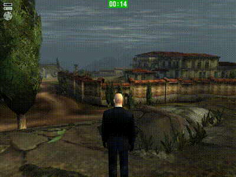
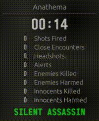
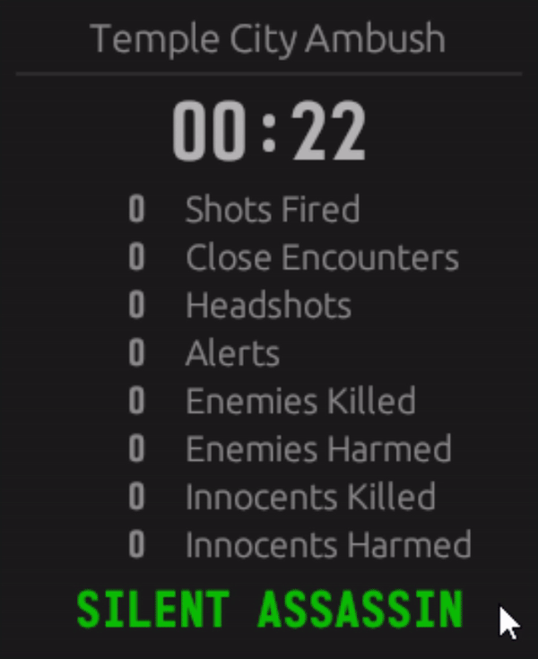

# Hitman StatTracker

  <a href="https://github.com/Attrup/StatTracker/releases">Download latest release</a>

Hitman StatTracker is a statistics tracker for the classic Hitman games, Hitman 2 SA and Hitman Contracts, written in pure Rust using egui. The app tracks all eight of the critical statistics used by the game to calculate mission rating in real-time, and makes both stats and the Silent Assassin status easily visible to the user in a standalone window. In addition to the standalone window, *Hitman StatTracker* offers a resizeable game overlay that displays both the mission timer, and Silent Assasin status on top of the game. Multiple color options as well as both a light and dark theme are available to easily customize the app to suit your requirements. 

  &nbsp;&nbsp;&nbsp;&nbsp;&nbsp;&nbsp;

## User guide
To use the StatTracker have the app running alongide any of the supported games. The app will automatically detect compatible games and read and display the appropriate statistics. If no supported games are running, the app will simply show a waiting screen, until a compatible game is detected. To enable the overlay or change other user settings, simply enter the settings menu by **clicking on the mission timer** or pressing the settings button on the waiting screen.

  

## Acknowledgements
Full credit for the original idea of this app goes to [nvillemin](https://github.com/nvillemin) who created the original [Hitman Statistics](https://github.com/nvillemin/HitmanStatistics) app, and figured out the specifics for retrieving mission stats.

## Installation
### Simple
A precompiled executable is available on the releases page or through the link in the top of the readme.

### Build from source
The process of building the application from source is very straight forward due to the simplicity of managing dependencies provided by *Cargo*, the package manager for Rust. Note that the app as Windows specific dependencies and will therefore only build and run on Windows.

#### Required build tools:
- Rust compiler (At least version 1.76)
- Cargo package manager

Both can be obtained simply by installing Rust using *rustup* from the Rust-lang website: [Link](https://www.rust-lang.org/tools/install).

#### Building:
- Clone the repository to a desired directory:  
`git clone https://github.com/Attrup/StatTracker.git`
- Navigate to the root of the cloned repo and compile using:  
`cargo build --release`
- Wait a couple of minutes for the dependencies to install and the app to build
- Once finished, the executable can be found at:  
`target\release\StatTracker.exe`
